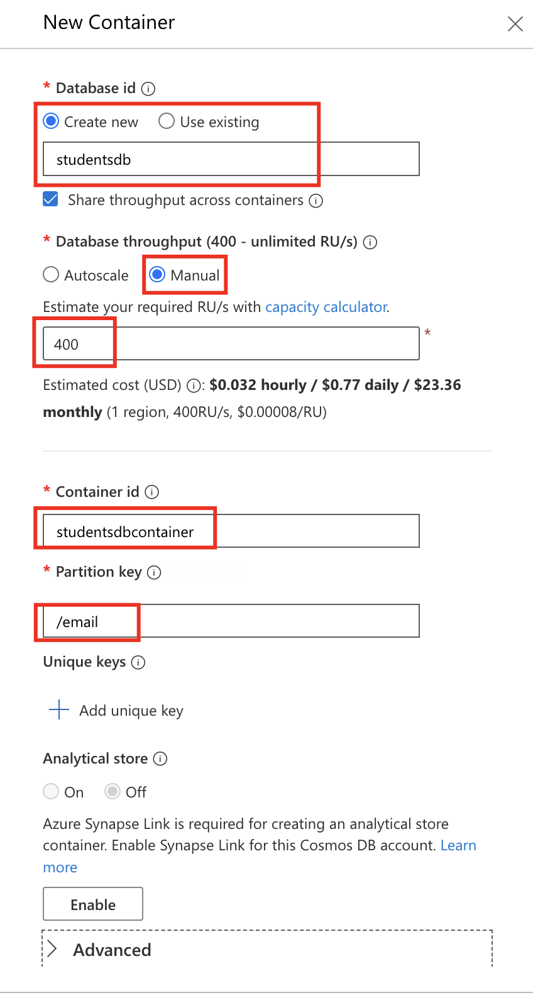
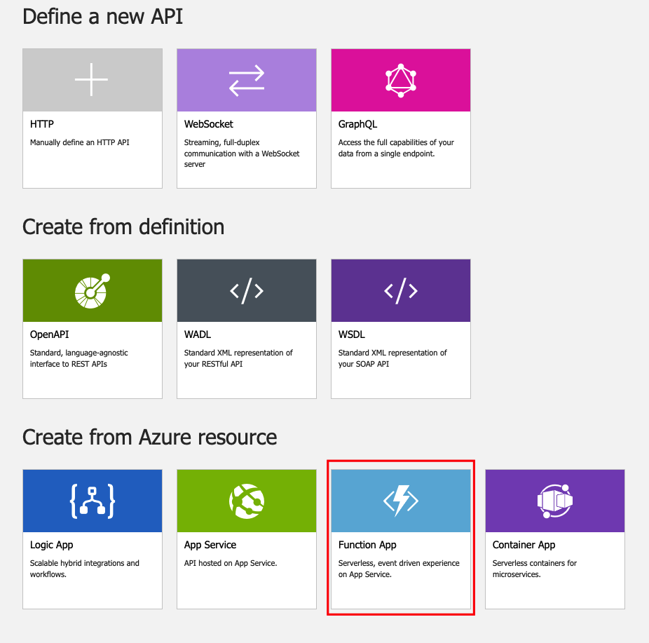
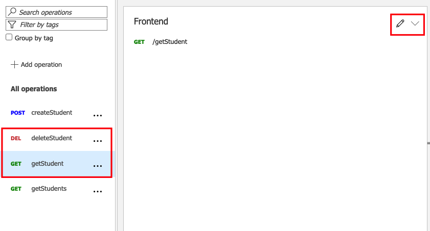
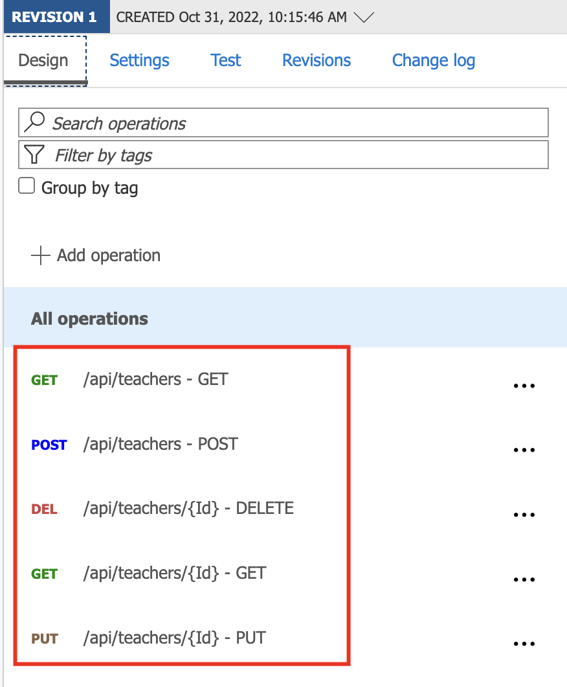
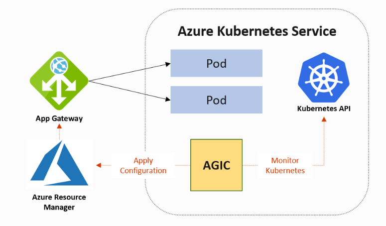
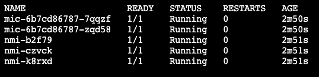
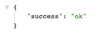
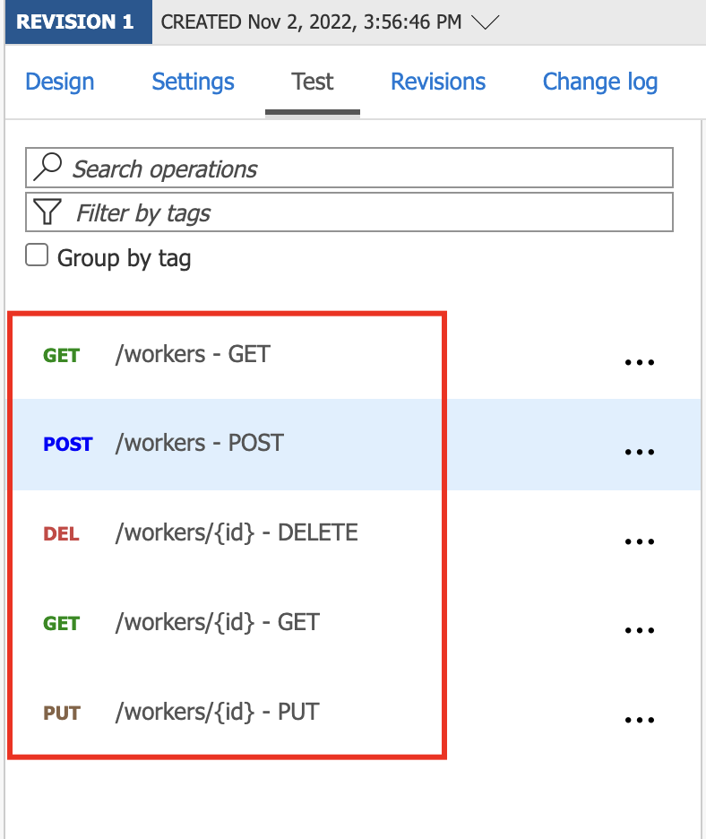
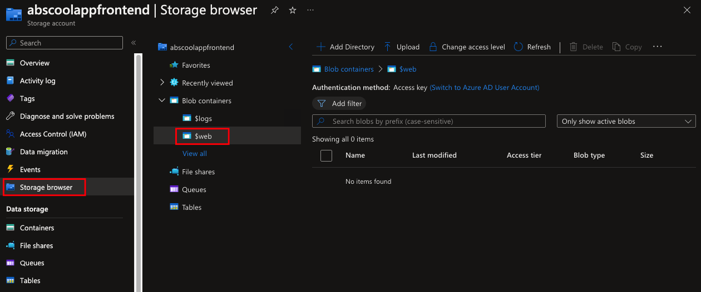
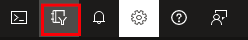

# Multi Runtime Environment (MRE) Application 
- Create a Resource Group for entire project
- Create an API Management Service 
- Create an Function App 
- Create a Web App  
- Create an AKS Cluster 
- Create an Azure Container Registry 
- Create a Blob Storage 
- Create an Active Directory B2C Tenant and App

## Architecture


## Table of Contents
 - [Prerequisites](#prerequisites)
 - [Create a Resource Group](#create-a-resource-group)
 - [Create API Management Service](#create-api-management-service)
 - [Create Students Microservice](#create-students-microservice)
   - [Create CosmosDB Database for students API](#create-cosmosdb-database-for-students-api)
   - [Create Function App for students API](#create-function-app-for-students-api)
 - [Create Teachers Microservice](#create-teachers-microservice)
   - [Create SQL database for teachers API](#create-sql-database-for-teachers-api)
   - [Create AppService for Teachers API](#create-appservice-for-teachers-api)
   - [Create Teachers API in API Management](#create-teachers-api-in-api-management)
 - [Create Workers Microservice](#create-workers-microservice)
   - [Create SQL database for workers API](#create-sql-database-for-workers-api)
   - [Create AKS Cluster with Application Gateway Ingress Controller](#create-aks-cluster-with-application-gateway-ingress-controller)
   - [Upgrade AKS cluster with Azure Key Vault Provider for Secrets Store CSI Driver support](#upgrade-aks-cluster-with-azure-key-vault-provider-for-secrets-store-csi-driver-support)
   - [Create ACR for Docker Images](#create-acr-for-docker-images)
   - [Deploy Workers Application to AKS Cluster](#deploy-workers-application-to-aks-cluster)
   - [Create Workers API in API Management](#create-workers-api-in-api-management)  
 - [Hosting Serverless UI on Azure Blob Storage](#hosting-serverless-ui-on-azure-blob-storage)
 - [Securing EMR Application](#securing-emr-application)
   - [Azure ADB2C](#azure-adb2c)
   - [Authenticating API Requests](#authenticating-api-requests)
   


## Prerequisites
- Azure Subscription
- Azure CLI 
- kubectl CLI 
- Docker CLI
- Donet 6
- Node 16
- Visual Studio (Community/Enterprise)


# Steps
## Create a Resource Group 
1. Go to Azure Portal
2. Create a resource group - **schoolapp** in your subscription
## Create API Management service
1. Go to Azure Portal 
2. Create a resource - API Management
3. In Project Details
    - ```Subscription``` - Choose your subscription
    - ```Resource Group``` - Choose **schoolapp** resource group
    - ```Region``` - Choose West Europe
    - ```Resource name``` - Choose **schoolappapimanagement**
    - ```Organization name``` - Choose your organization name
    - ```Administrator email``` - Choose your administrator email
    - ```Pricing tier``` - Choose Consumption tier
    - ```System assigned managed identity``` - Mark the Status
    - ```Connectivity type``` - None
4. Review + create 
5. Create

**_NOTE:_** API creation may take around 40-50 minutes.

# Create Students Microservice
## Create CosmosDB Database for students API
1. Go to Azure Portal
2. Create a resource - Azure Cosmos DB
3. Choose - Azure Cosmos DB for NoSQL
   - ```Subscription``` - Choose your subscription
   - ```Resource Group``` - Choose **schoolapp** resource group
   - ```Account Name``` - Choose unique account name
   - ```Location``` - Choose your location
   - ```Capacity mode``` - Provisioned throughput
   - ```Apply Free Tier Discount``` - Apply if you want discount 
4. Review + create
5. Create
6. Go to your CosmosDB account
7. Create a Container
   - ```Database id``` - studentdb
   - ```Database throughput``` - Manual - 400
   - ```Container id``` - studentsdbcontainer
   - ```Partition key``` - /email



8. Go to studentsdbcontainer -> Items
9. New Item 
   ```
   {
    "Email": "student1@mtc.com",
    "Name": "Student One",
    "Age": 22,
    "Gender": "Male",
    "Class": "History"
   }
   ```
10. Save

## Create Function App for Students API
[Create Function App for Students api](./nodejs_functions_backend_students_api/)

## Create Students API 
1. Go to your API management - schoolappapimanagement
2. Select APIs 
3. In Define a new API select Function App  
  
4. Click on Browse
5. Click Select 
6. Choose studentsapp and hit Select  
   
**_NOTE:_** If you don't see your function app in the functions list, create a managed identity and give a contributor role to your function app  
  
1. Check all your functions and hit Select
2. ```API URL suffix``` - Choose students
3.  Hit Create
4.  Go to deleteStudent and getStudent functions
5.  Edit Frontend  
  
12. Under Query add an email parameter and check required box
13. Hit Save  
14. Test the APIs  
  
**_NOTE:_** To test your API in API clients like POSTMAN, you need to add a Header with key - **Ocp-Apim-Subscription-Key** and value of **Subscriptions key** from the Subscription section in the API blade

# Create Teachers Microservice
## Create SQL database for teachers API
1. Go to Azure Portal
2. Create a resource - SQL Database 
   - ```Subscription``` - Choose your subscription
   - ```Resource Group``` - Choose **schoolapp** resource group
   - ```Database Name``` - Choose **teachersdb**
   - ```Server``` - Hit Create new
     - ```Server name``` - Choose unique server name for example <yourname><schoolappserver>
     - ```Location``` - Choose West Europe
     - ```Authentication method``` - Use SQL authentication and choose admin login and password
     - Hit Ok
     - ```Compute + storage``` - Choose Configure database
       - ```Service tier``` - select DTU-based purchasing model - Basic
       - Hit Apply
     - ```Backup storage redundancy``` - Choose Locally-redundant backup storage
     - ```Connectivity method``` - Select Public endpoint (For this demo only)
     - Review + create\
     - Create
   - ```Location``` - Choose your location
   - ```Capacity mode``` - Provisioned throughput
   - ```Apply Free Tier Discount``` - Apply if you want discount   
   - Go to your SQL server blade
   - ```Public network access``` - Selected networks -> Add your ip address 
   - ```Allow Azure services and resources to access this server``` - Check 
3. Go to teachersdb database 
4. Choose Query editor in database blade
5. Login with sql server admin credentials 
6. In Query Editor create teachers table:
   ```
    CREATE TABLE Teachers (
    Id int IDENTITY(1,1) PRIMARY KEY,
    Email varchar(255) UNIQUE,
    Name varchar(255),
    Age int,
    Gender varchar(255),
    );
   ```
7. In Query Editor create few rows:  
   ```
    INSERT INTO Teachers (Email, Name, Age, Gender) VALUES ('Teacher1@mtc.com', 'Teacher One', 45, 'Male')
    INSERT INTO Teachers (Email, Name, Age, Gender) VALUES ('Teacher2@mtc.com', 'Teacher Two', 32, 'Female')
    INSERT INTO Teachers (Email, Name, Age, Gender) VALUES ('Teacher3@mtc.com', 'Teacher Three', 29, 'Female')
   ```

## Create AppService for Teachers API
[Create AppService for Teachers API](./dotnet_webapp_backend_teachers)

## Create Teachers API in API Management
1. Go to your API management - schoolappapimanagement
2. Select APIs 
3. Select Add API 
4. From the API list select OpenAPI 
5. ```OpenAPI specification``` - Paste the swagger url
6. Hit Create
7. Your API is going to look like this:   
  
     

8. Test the routes from the API management
  

# Create Workers Microservice
## Create SQL database for workers API
1. Go to Azure Portal
2. Create a resource - SQL Database 
   - ```Subscription``` - Choose your subscription
   - ```Resource Group``` - Choose **schoolapp** resource group
   - ```Database Name``` - Choose **workersdb**
   - ```Server``` - Choose the same server you created in teachers microservice for example <yourname><schoolappserver>
   - ```Compute + storage``` - Choose Configure database
       - ```Service tier``` - select DTU-based purchasing model - Basic
       - Hit Apply
   - ```Capacity mode``` - Provisioned throughput
   - ```Apply Free Tier Discount``` - Apply if you want discount   
   - Go to your SQL server blade
   - ```Public network access``` - Selected networks -> Add your ip address 
   - ```Allow Azure services and resources to access this server``` - Check 
3. Go to workersdb database 
4. Choose Query editor in database blade
5. Login with sql server admin credentials 
6. In Query Editor create teachers table:
   ```
    CREATE TABLE Workers (
    Id int IDENTITY(1,1) PRIMARY KEY,
    Email varchar(255) UNIQUE,
    Name varchar(255),
    Age int,
    Gender varchar(255),
    );
   ```
7. In Query Editor create few rows:  
   ```
    INSERT INTO Workers (Email, Name, Age, Gender) VALUES ('Worker1@mtc.com', 'Worker One', 27, 'Male')
    INSERT INTO Workers (Email, Name, Age, Gender) VALUES ('Worker2@mtc.com', 'Worker Two', 23, 'Female')
    INSERT INTO Workers (Email, Name, Age, Gender) VALUES ('Worker3@mtc.com', 'Worker Three', 35, 'Female')
    INSERT INTO Workers (Email, Name, Age, Gender) VALUES ('Worker4@mtc.com', 'Worker Four', 51, 'Male')
   ```

## Create AKS Cluster with Application Gateway Ingress Controller
### Architecture
 

**_NOTE:_**  We recommend the use of [Azure Cloud Shell](https://shell.azure.com/) for all command line operations below.  

### Steps  
1. Create AD service principal. 
   ```bash
    az ad sp create-for-rbac -o json > auth.json
    appId=$(jq -r ".appId" auth.json)
    password=$(jq -r ".password" auth.json)
   ```
2. Create Environment variables:
   ```bash
   objectId=$(az ad sp show --id $appId --query "id" -o tsv)
   location="westeurope"
   kubernetesVersion=$(az aks get-versions --location $location --query "orchestrators[-1].orchestratorVersion" -o tsv)
   ```
3. Paste the entire command below (It is a single command on multiple lines) in Cloud Shell to create the `parameters.json` file. It will be used in the ARM template deployment.
    ```bash
    cat <<EOF > parameters.json
    {
      "aksServicePrincipalAppId": { "value": "$appId" },
      "aksServicePrincipalClientSecret": { "value": "$password" },
      "aksServicePrincipalObjectId": { "value": "$objectId" },
      "aksEnableRBAC": { "value": false },
      "kubernetesVersion":{"value":"$kubernetesVersion"}
    }
    EOF
    ```
   To deploy an **RBAC** enabled cluster, set the `aksEnabledRBAC` field to `true`. View the contents of the newly created file with `cat parameters.json`. It will contain the values of the `appId`, `password`, and `objectId` bash variables from the previous steps.

4. Deploy Components
    
   The next few steps will add the following list of components to your Azure subscription:
      - [Azure Kubernetes Service](https://docs.microsoft.com/en-us/azure/aks/intro-kubernetes)
      - [Application Gateway](https://docs.microsoft.com/en-us/azure/application-gateway/overview) v2
      - [Virtual Network](https://docs.microsoft.com/en-us/azure/virtual-network/virtual-networks-overview) with 2 [subnets](https://docs.microsoft.com/en-us/azure/virtual-network/virtual-networks-overview)
      - [Public IP Address](https://docs.microsoft.com/en-us/azure/virtual-network/virtual-network-public-ip-address)
      - [Managed Identity](https://docs.microsoft.com/en-us/azure/active-directory/managed-identities-azure-resources/overview), which will be used by [AAD Pod Identity](https://github.com/Azure/aad-pod-identity/blob/master/README.md)
   1. Download the ARM template into `template.json` file. Paste the following in your [shell](https://shell.azure.com/):
        
      ```bash
      wget https://raw.githubusercontent.com/Azure/application-gateway-kubernetes-ingress/master/deploy/azuredeploy.json -O template.json
      ```  
   2. Deploy the ARM template via [Azure Cloud Shell](https://shell.azure.com/) and the `az` tool. Modify the name of the resource group and region/location, then paste each of the following lines into your [shell](https://shell.azure.com/):    
       
      ```bash
      resourceGroupName="schoolapp"

      deploymentName="school-ingress-appgw"

      az group create -n $resourceGroupName -l $location # Use only if you want to deploy in a new resource group.

      az deployment group create -g $resourceGroupName -n $deploymentName --template-file template.json --parameters parameters.json
      ```  
      
    Note: The last command may take a few minutes to complete.  
   3. Once the deployment finished, download the deployment output into a file named `deployment-outputs.json`.  
   
      ```bash
         az deployment group show -g $resourceGroupName -n $deploymentName --query "properties.outputs" -o json > deployment-outputs.json
      ```
     View the content of the newly created file with: `cat deployment-outputs.json`. The file will have the following shape (example):

      ```
      {
         "aksApiServerAddress": {
         "type": "String",
         "value": "aks-abcd41e9.hcp.westus2.azmk8s.io"
         },
         "aksClusterName": {
         "type": "String",
         "value": "aksabcd"
         },
         "applicationGatewayName": {
         "type": "String",
         "value": "applicationgatewayabcd"
         },
         "identityClientId": {
         "type": "String",
         "value": "7b1a3378-8abe-ab58-cca9-a8ef624db293"
         },
         "identityResourceId": {
         "type": "String",
         "value": "/subscriptions/a6466a81-bf0d-147e-2acb-a0ba50f6456e/resourceGroups/MyResourceGroup/providers/Microsoft.ManagedIdentity/userAssignedIdentities/appgwContrIdentityabcd"
         },
         "resourceGroupName": {
         "type": "String",
         "value": "MyResourceGroup"
         },
         "subscriptionId": {
         "type": "String",
         "value": "a6466a81-bf0d-147e-2acb-a0ba50f6456e"
         }
      }
      ```

5. Set up Application Gateway Ingress Controller  
   With the instructions in the previous section we created and configured a new AKS cluster and an App Gateway. We are now ready to deploy a workers app and an ingress controller to our new Kubernetes infrastructure.  

   1. Setup Kubernetes Credentials  
      For the following steps we need setup [kubectl](https://kubectl.docs.kubernetes.io/) command,
      which we will use to connect to our new Kubernetes cluster. [Cloud Shell](https://shell.azure.com/) has `kubectl` already installed. We will use `az` CLI to obtain credentials for Kubernetes.  
        
      Get credentials for your newly deployed AKS ([read more](https://docs.microsoft.com/en-us/azure/aks/kubernetes-walkthrough#connect-to-the-cluster)):

      ```bash
      # use the deployment-outputs.json created after deployment to get the cluster name and resource group name
      aksClusterName=$(jq -r ".aksClusterName.value" deployment-outputs.json)
      resourceGroupName=$(jq -r ".resourceGroupName.value" deployment-outputs.json)

      az aks get-credentials --resource-group $resourceGroupName --name $aksClusterName
      ```

      Test the connection:  
      ```bash
      kubectl get nodes
      ```
   2. Install AAD Pod Identity  

      Azure Active Directory Pod Identity provides token-based access to [Azure Resource Manager (ARM)](https://docs.microsoft.com/en-us/azure/azure-resource-manager/resource-group-overview).  

      [AAD Pod Identity](https://github.com/Azure/aad-pod-identity) will add the following components to your Kubernetes cluster:  
         - Kubernetes [CRDs](https://kubernetes.io/docs/tasks/access-kubernetes-api/custom-resources/custom-resource-definitions/): `AzureIdentity`, `AzureAssignedIdentity`, `AzureIdentityBinding`  
         - [Managed Identity Controller (MIC)](https://github.com/Azure/aad-pod-identity#managed-identity-controller) component  
         - [Node Managed Identity (NMI)](https://github.com/Azure/aad-pod-identity#node-managed-identity) component  
        
      To install AAD Pod Identity to your cluster:  
         - *RBAC enabled* AKS cluster

            ```bash
            kubectl apply -f https://raw.githubusercontent.com/Azure/aad-pod-identity/v1.8.6/deploy/infra/deployment-rbac.yaml
            ```

         - *RBAC disabled* AKS cluster

            ```bash
            kubectl apply -f https://raw.githubusercontent.com/Azure/aad-pod-identity/v1.8.6/deploy/infra/deployment.yaml
            ```

      ***Note:*** AAD Pod Identity introduced a [breaking change](https://github.com/Azure/aad-pod-identity/tree/v1.6.0#v160-breaking-change) after v1.5.5 regarding CRD fields become case sensitive, for any AAD Pod Identity version >= 1.6.0 or you plan to apply from master branch such as https://raw.githubusercontent.com/Azure/aad-pod-identity/master/deploy/infra/deployment-rbac.yaml, AGIC version at least [v1.2.0-rc2](https://github.com/Azure/application-gateway-kubernetes-ingress/blob/master/CHANGELOG/CHANGELOG-1.2.md#v120-rc2) will be required, more details please refer to [troubleshooting](../troubleshootings/troubleshooting-agic-fails-with-aad-pod-identity-breakingchange.md).

      Check if all pods are running:  
      ```bash
      kubectl get pods
      ```  

        

   3. Install AGIC with Helm
        
      [Helm](https://docs.microsoft.com/en-us/azure/aks/kubernetes-helm) is a package manager for Kubernetes. This document will use version 3 of helm, which is not backwards compatible with previous versions.

      1. Add the AGIC Helm repository:

         ```bash
         helm repo add application-gateway-kubernetes-ingress https://appgwingress.blob.core.windows.net/ingress-azure-helm-package/
         helm repo update
         ```
      
      2. Install Ingress Controller Helm Chart
         1. Use the `deployment-outputs.json` file created above and create the following variables.
            
            ```bash
               applicationGatewayName=$(jq -r ".applicationGatewayName.value" deployment-outputs.json)
               resourceGroupName=$(jq -r ".resourceGroupName.value" deployment-outputs.json)
               subscriptionId=$(jq -r ".subscriptionId.value" deployment-outputs.json)
               identityClientId=$(jq -r ".identityClientId.value" deployment-outputs.json)
               identityResourceId=$(jq -r ".identityResourceId.value" deployment-outputs.json)
            ```
      
      3. Download sample-helm-config.yaml, which will configure AGIC:  
         
         ```bash
         wget https://raw.githubusercontent.com/Azure/application-gateway-kubernetes-ingress/master/docs/examples/sample-helm-config.yaml -O helm-config.yaml
         ```
      4. Edit the newly downloaded helm-config.yaml and fill out the sections `appgw` and `armAuth`.
         
         ```bash
         sed -i "s|<subscriptionId>|${subscriptionId}|g" helm-config.yaml
         sed -i "s|<resourceGroupName>|${resourceGroupName}|g" helm-config.yaml
         sed -i "s|<applicationGatewayName>|${applicationGatewayName}|g" helm-config.yaml
         sed -i "s|<identityResourceId>|${identityResourceId}|g" helm-config.yaml
         sed -i "s|<identityClientId>|${identityClientId}|g" helm-config.yaml
         ```
      5. Install the Application Gateway ingress controller package:  
         Check the latest stable [version](https://github.com/Azure/application-gateway-kubernetes-ingress/releases)
 
         ```bash
         helm install ingress-azure \
         -f helm-config.yaml \
         application-gateway-kubernetes-ingress/ingress-azure \
         --version 1.5.2
         ```  
           
         >Note: Use at least version 1.4.0, i.e. `--version 1.4.0`, when installing on k8s version >= 1.16. Kubernetes >= 1.22 requires version 1.5.0 (or higher).


## Workload identity

```bash
az aks update --name aksba92 --resource-group schoolapp --enable-oidc-issuer
az aks addon list -g schoolapp -n aksba92 # show addon list 
```

## Upgrade AKS cluster with Azure Key Vault Provider for Secrets Store CSI Driver support
1. Open Cloud Shell
2. Run:  
   ```bash
   az aks enable-addons --addons azure-keyvault-secrets-provider --name $aksClusterName --resource-group $resourceGroupName
   ```
3. Verify the Azure Key Vault Provider for Secrets Store CSI Driver installation:  
   ```bash
   kubectl get pods -n kube-system -l 'app in (secrets-store-csi-driver, secrets-store-provider-azure)'

   NAME                                     READY   STATUS    RESTARTS   AGE
   aks-secrets-store-csi-driver-4vpkj       3/3     Running   2          4m25s
   aks-secrets-store-csi-driver-ctjq6       3/3     Running   2          4m21s
   aks-secrets-store-csi-driver-tlvlq       3/3     Running   2          4m24s
   aks-secrets-store-provider-azure-5p4nb   1/1     Running   0          4m21s
   aks-secrets-store-provider-azure-6pqmv   1/1     Running   0          4m24s
   aks-secrets-store-provider-azure-f5qlm   1/1     Running   0          4m25s
   ```


## Create a Key Vault and store the secrets for database connection
1. Go to Azure Portal
2. Create a resource - Key Vault 
3. In Key Vault details:  
    - ```Subscription``` - Choose your subscription
    - ```Resource Group``` - Choose **schoolapp** resource group
    - ```Key vault name``` - Choose a unique name 
    - ```Region``` - Choose West Europe
    - ```Pricing tier``` - Standard
4. Review + create
5. Create


## Create ACR for Docker Images
1. Go to Azure Portal
2. Create a Container Registry
3. In Registry details:  
    - ```Subscription``` - Choose your subscription
    - ```Resource Group``` - Choose **schoolapp** resource group
    - ```Registry Name``` - Choose a unique name 
    - ```Location``` - Choose West Europe
    - ```SKU``` - Standard
4. Review + create
5. Create
6. Configure ACR integration with our AKS cluster
   1. Open Cloud Shell
   2. Integrate an existing ACR with existing AKS clusters by supplying valid values for acr-name or acr-resource-id as below.
      ```bash
      acrId=$(az acr show -n <registryName> -g schoolapp --query id)
      az aks update -n $aksClusterName -g $resourceGroupName --attach-acr $acrId
      ```
## Deploy Workers Application to AKS Cluster
1. Open Cloud Shell  
2. Clone the git repo
3. Open the project - multienvapponazure/nodejs_aks_backend_workers/
4. Build the image and push it to your ACR:  
   ```bash
   az acr build --image workers:0.1 --registry <registryName> --file Dockerfile .
   ```
5. In the workers-k8s.yaml file, replace the image name with yours, the file will have the following shape (exmaple):    
   ```bash
   - image: "<registryName>.azurecr.io/workers:0.1"
     name: workersapp
     ports:
     - containerPort: 8080
       protocol: TCP
   ``` 
6. To create Pod, Service and Ingress resources run:    
   ```bash
   kubectl create -f workers-k8s.yaml
   ```
7. To show your ingress ip run:  
   ```bash
   kubectl get ingress
   ```
8. Open a web browser and check the app - http://ingressIpAddress:80  
     
       
   

## Create Workers API in API Management
1. Clone the git repo
2. Open the project - multienvapponazure/nodejs_aks_backend_workers/swagger_output.json
3. Go to your API management - schoolappapimanagement
4. Select APIs 
5. Select Add API 
6. From the API list select OpenAPI 
7. ```OpenAPI specification``` - Paste the swagger file
8. Hit Create
9. Your API is going to look like this:  
   
    

10. Go to Settings
11. Change ```Web service URL``` - http://ingressIp/api
12. Hit Save


## Hosting Serverless UI on Azure Blob Storage
1. Go to Azure Portal
2. Create a resource - Storage account 
3. In Storage account details:  
    - ```Subscription``` - Choose your subscription
    - ```Resource Group``` - Choose **schoolapp** resource group
    - ```Storage account name``` - Choose a unique name 
    - ```Region``` - Choose West Europe
    - ```Redundancy``` - LRS
4. Hit Review 
5. Hit Create
6. Go to resource
7. In left navigation panel choose ***Static website***
8. in Static Website details:
   - ```Static website``` - Enabled
   - ```index document name``` - index.html
   - ```Error document path``` - index.html
9. Hit Save 
10. Go your storage account and select ***Storage browser***
11. In Blob containers select $web - It is the place where you upload a website.  
      
      
      
12. Clone the git repo
13. Open the project - multienvapponazure/react_frontend_website_no_authentication
14. Run ```npm install```
15. Run ```npm run build``` - Build a project and store it in a build directory
16. Upload all files to $web directory in a storage account 
17. In left navigation panel choose ***Static website***
18. Copy the ***Primary endpoint*** url and test in your web browser


## Securing EMR Application

### Azure ADB2C
* Identity management service
* Sign up and sign in using email address
* Sign in using social identity providers like Facebook, Google, Linkedin, etc.
* ADB2C Suppots OpenID Connect, OAuth 2.0 and SAML authentication protocols
* ADB2C manages user passwords
* Default sign up/sign in and password reset authentication flows
* Bring your own branding 
* Serverless 
* Azure ADB2C tenant different from Azure AD tenant
* Documentation: [ADB2C](https://learn.microsoft.com/en-us/azure/active-directory-b2c/) , [Pricing](https://azure.microsoft.com/en-us/pricing/details/active-directory/external-identities/)

Create Azure ADB2C:  
1. Go to Azure Portal
2. Create a resource - Azure Active Directory B2C
3. Select ***Create a new Azure AD B2C Tenant***
4. In Create a tenant details:
   - ```Organization name``` - abschooltenant
   - ```Initial domain name``` - abschooltenant
   - ```Country/Region``` - Ireland
   - ```Subscription``` - Choose your subscription
   - ```Resource Group``` - Choose **schoolapp** resource group
5. Hit Review + Create
6. Hit Create  
**_NOTE:_** Tenant creation may take around 5 minutes.

7. To switch to your new directory select the ***directories + subscriptions*** icon:  
  
     
  
8. Select your new directory and click Switch
  
   

9. In new created tenant go to Azure AD B2C Main page
10. In left side menu go to ***App registrations*** 
11. Hit ***New registration***
12. In Register an application:  
    - ```Name``` - ***schoolapp***
    - ```Supported account types``` - Select ***Accounts in any identity provider or organizational directory***
13. Hit Register  
14. In Overview click ***Add a Redirect URI***
15. Hit ***+Add a platform***
16. Select ***Web***
17. In Configure Web:  
    - ```Redirect URIs``` - https://jwt.ms
    - ```Implicit grant and hybrid flows``` - Check the ***Access tokens(used for implicit flows)***
18. Hit Configure 
19. Go to Azure AD B2C Home Page
20. In left side menu go to ***User flows***
21. Hit ***+New user flow***
22. Select ***Sign up and sign in*** User flow
23. Hit Create
24. In Create:  
    - ```B2C_1_``` - SignUpSignin
    - ```Local accounts``` - Check ***Email signup***
25. Hit Create 
26. Select the user flow your create - ***B2C_1_SignUpSignin***
27. In left side menu go to ***User attributes***
28. Check a ***Email Address*** User attribute
29. Hit Save 
30. Hit Run user flow
31. You can create a temporary email account [here](https://temp-mail.org/)
32. Go to Azure B2C Home Page
33. In left side menu go to ***Users***
34. Check if a new user you created exists in the list


### Authenticating API Requests
1. Switch back to your default directory 
2. Open your API service 
3. Select APIs
4. Select a API
5. In All operations under Inbound processing click ***+Add policy***
6. Choose Validate JWT 
7. Choose full to expand all the options
8. Fill:  
   - ```Header name``` - Authorization
   - ```Failed validation error message``` - Missing or invalid token
   - ```Require expiration time``` - Yes
   - ```Require signed tokens?``` - Yes
   - ```Audiences``` - Go to AD B2C and copy your application (client) ID
   - ```Issuers``` - Go to AD B2C User flow -> Run user flow -> Open OpenID configuration url and copy the issuer url
   - ```Open ID URLs``` - Go to AD B2C User flow -> Run user flow -> Open OpenId configuration url and copy the url 
9. Hit Save 
10. Repeat the steps for all APIs


