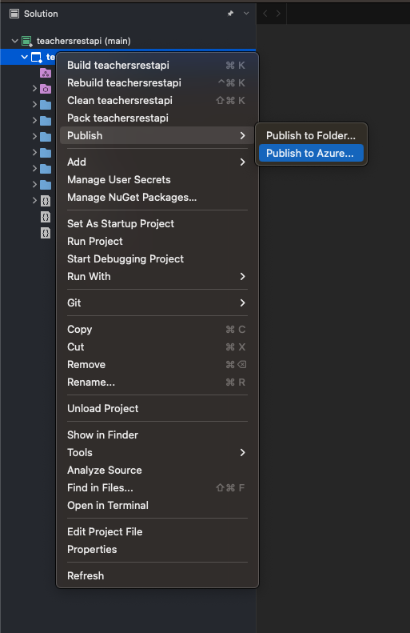
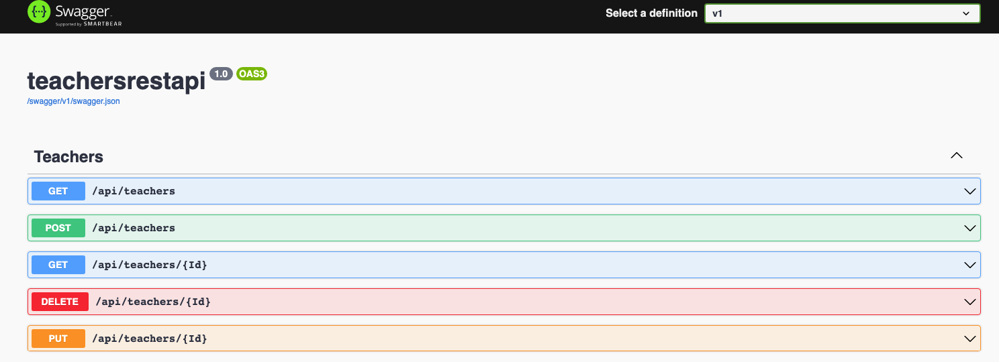
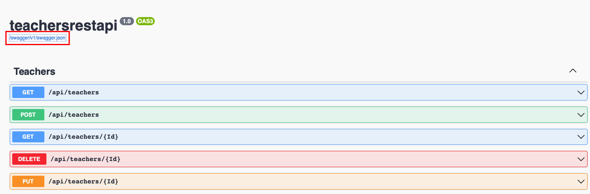

# Teachers Web App 
.Dotnet 6 Web App API with 5 functions:  
`/api/teachers - GET` - Get all teachers data from SQL DB    
`/api/teachers/Id GET` - Get a teacher by teacher Id from SQL DB  
`/api/teachers/Id PUT` - Update a teacher by teacher Id  
`/api/teachers POST` - Create a teacher in SQL DB    
`/api/teachers/Id DELETE` - Delete a teacher from SQL DB  

## Table of Contents

## 
1. Git clone 
2. Open Visual Studio 
3. Open the project file - workshops/mtc_multi_environment_workshop/dotnet_webapp_backend_teachers/teachersrestapi/teachersrestapi.sln
4. Change the configuration in appsettings.json to connect to your db
5. Publish the project to Azure App Service  
  
     
6. Create new App Service from Visual Studio UI 
7. Deploy your application
8. Main page of the application - Swagger 
  
    

10. Open the swagger.json file from Swagger ui 
    
    

11. Copy the swagger url

