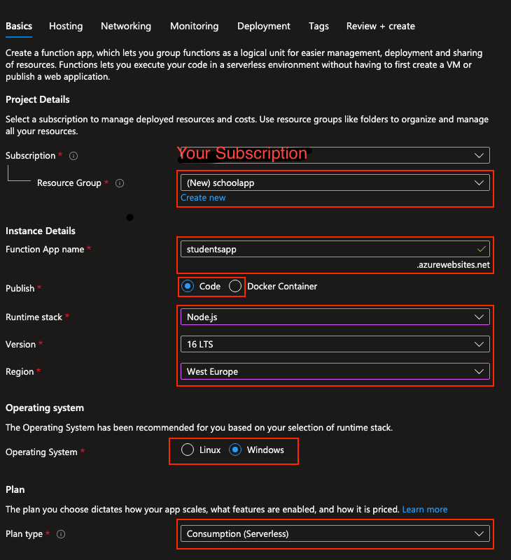
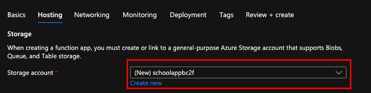
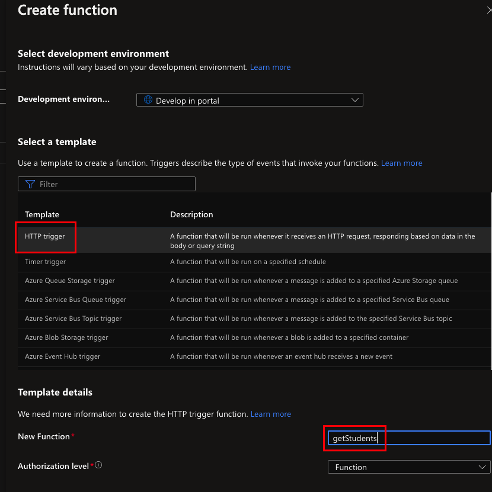
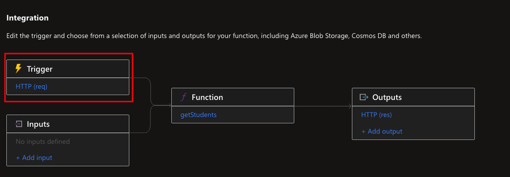
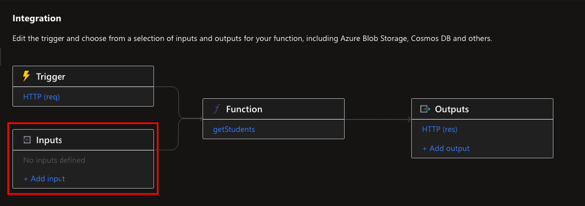
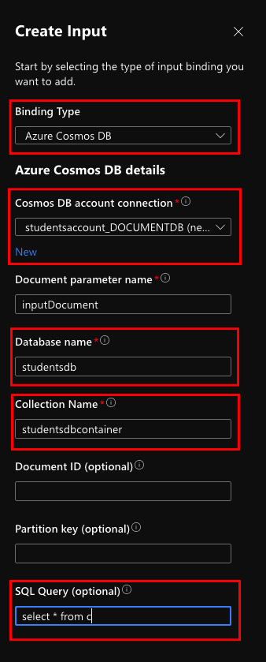
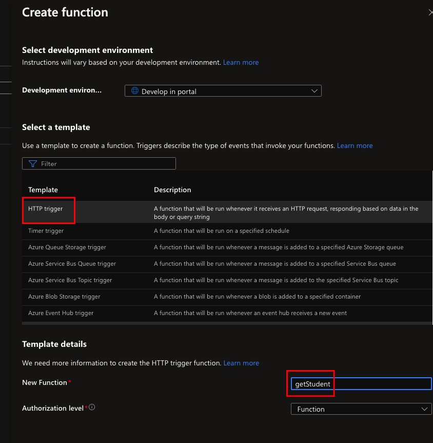
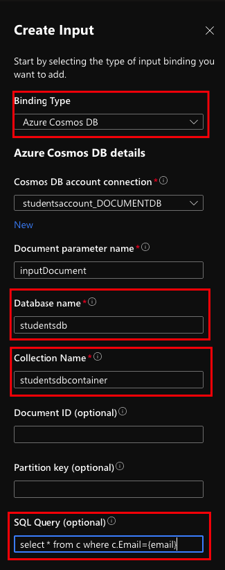
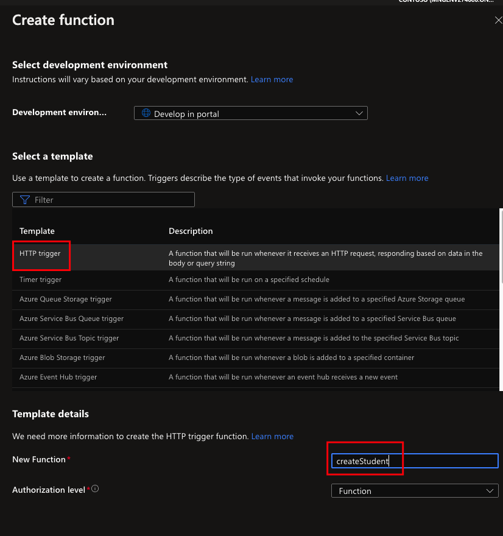
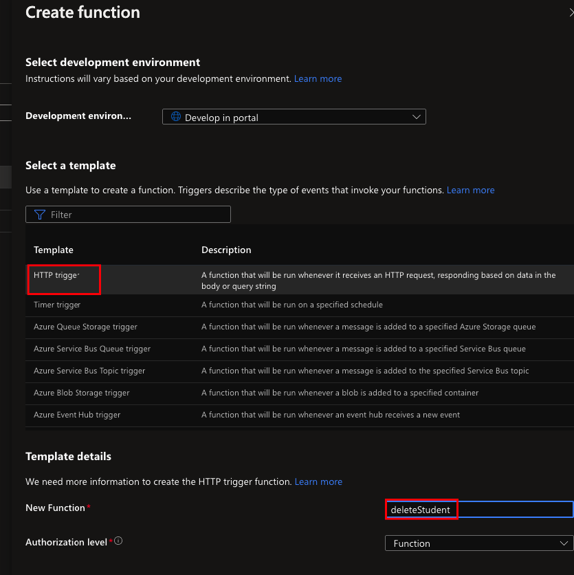

# Students Function App 
Nodejs based serverless function application with 4 functions:   
`getStudents` - Get all students data from cosmosDB  
`getStudent` - Get existing student data from cosmosDB  
`createStudent` - Create a student in cosmosDB  
`deleteStudent` - Delete a student from cosmosDB

## Table of Contents
- Create Azure Function App
- Create 4 Functions


----

## Create Azure Function App
1. Go to Azure Portal
2. Create a resource - Function app 
3. Follow this settings:

  



4. Hit Review + create and Create

----

## Create 4 Functions

### getStudents Function 
1. Go to your function app 
2. Select Functions from the blade 
3. Create
4. Follow this settings:
   


5. Hit Create
6. Go to your function
7. Select Integration from function blade
8. Hit Trigger:
   


9. In Selected HTTP methods select only the **GET** Method
10. Hit Save
11. Hit Inputs -> Add Input:
    


12: Follow this settings (Choose your cosmosdb connection and database details):



13. Go to code + test in function blade
14. Paste the code: 

```
    module.exports = async function (context, req, inputDocument) {
    context.log('Get all students function.');
    context.log(inputDocument);
 
    context.res = {
        body: inputDocument
    };
} 
```

15. Save the function .
16. Test/Run the function.

### getStudent Function
1. Go to your function app 
2. Select Functions from the blade 
3. Create
4. Follow this settings:



5. Hit Create
6. Go to your function
7. Select Integration from function blade
8. Hit Trigger:


9. In Selected HTTP methods select only the **GET** Method
10. Hit Save
11. Hit Inputs -> Add Input:


12: Follow this settings (Choose your cosmosdb connection and database details):



13. Go to code + test in function blade
14. Paste the code: 

```
module.exports = async function (context, req, inputDocument) {
    context.log('Get student function');

    if (req.query.email) {
        context.res = {
            body: inputDocument
        };
    }
    else {
        context.res = {
            status: 400,
            body: "Please pass email on the query string"
        }
    }
}
```

15. Save the function.
16. Test/Run the function.

### createStudent Function
1. Go to your function app 
2. Select Functions from the blade 
3. Create
4. Follow this settings:



5. Hit Create
6. Go to your function
7. Select Integration from function blade
8. Hit Trigger:


9. In Selected HTTP methods select only the **POST** Method
10. Hit Save
11. Hit Inputs -> Add Input:


12: Follow this settings (Choose your cosmosdb connection and database details):


13. Go to code + test in function blade
14. Paste the code: 

```
const { CosmosClient } = require("@azure/cosmos");

var endpoint = process.env["CosmosDBEndpoint"];
var key = process.env["CosmosDBAuthKey"];
var databaseName = process.env["DatabaseName"];
var collectionName = process.env["CollectionName"];

const client = new CosmosClient({ endpoint, key });

module.exports = async function (context, req, inputDocument) {
    context.log('Create a student function');
    const { email, name, age, gender, class_type } = req.body;
    
    if (email == null || name == null || age == null || gender == null || class_type == null) {
        console.log("Bad request, please fill all the fields")
        context.res = {
            status: 400,
            body: 'Bad request. Please fill all the fields'
        }
    } else {
        const itemBody = {
            "Email": email,
            "Name": name,
            "Age": age,
            "Gender": gender,
            "Class": class_type
        }

        await client.database(databaseName).container(collectionName).items.upsert(itemBody)
        .then((status) => { 
            context.res = {
                // status: 200, /* Defaults to 200 */
                body: "Student Saved successfully"
            };
        })
        .catch((err) => { 
            context.res = {
                status: 500,
                body: err
            };
        });

    }
};
```

15. Save the function.
16. Next we need to install npm package:
    1. Go to your function app blade.
    2. In Development tools select console.
    3. ```console
        cd createStudent
        ```
    4. ```console
        npm init -y 
       ```
    5. ```console
        npm install @azure/cosmos 
       ```
17. Add cosmosDB environment variables to function app: 
    1.  Go to your function app.
    2.  Select Configuration from the blade.
    3.  Hit **New application setting** and create 4 environment variables:
        - CollectionName
        - CosmosDBAuthKey
        - CosmosDBEndpoint
        - DatabaseName
    4. Hit save 

18. Test the function - body example input: 
    ```
    {
        "email": "johndoe@johndoe.com",
        "name": "John Doe",
        "age": 65,
        "gender": "Male",
        "class_type": "History"
    }
    ```


### deleteStudent Function
1. Go to your function app 
2. Select Functions from the blade 
3. Create
4. Follow this settings:



5. Hit Create
6. Go to your function
7. Select Integration from function blade
8. Hit Trigger:


9. In Selected HTTP methods select only the **DELETE** Method
10. Hit Save
11. Hit Inputs -> Add Input:


12: Follow this settings (Choose your cosmosdb connection and database details):


13. Go to code + test in function blade
14. Paste the code: 

```
const { CosmosClient } = require("@azure/cosmos");

var endpoint = process.env["CosmosDBEndpoint"];
var key = process.env["CosmosDBAuthKey"];
var databaseName = process.env["DatabaseName"];
var collectionName = process.env["CollectionName"];

const client = new CosmosClient({ endpoint, key });

module.exports = async function (context, req, inputDocument) {
    context.log('deleteStudent function.');

    if(inputDocument.length != 0)
    {
        const itemBody = {
            "Email": req.query.email,
            "id": inputDocument[0].id
        }
        
        await client.database(databaseName).container(collectionName).item(itemBody.id, itemBody.email).delete(itemBody)
        .then((status) => { 
            context.res = {
                // status: 200, /* Defaults to 200 */
                body: "Student deleted successfully"
            };
        })
        .catch((err) => { 
            context.res = {
                status: 500,
                body: err
            };
        });        
    }
    else
    {
        context.res = {
            status: 404,
            body: "Student not found"
        };
    }
};
```

15. Save the function.
16. Next we need to install npm package:
    1. Go to your function app blade.
    2. In Development tools select console.
    3. ```console
        cd deleteStudent
        ```
    4. ```console
        npm init -y 
       ```
    5. ```console
        npm install @azure/cosmos 
       ```

17. Test the function with email query parameter